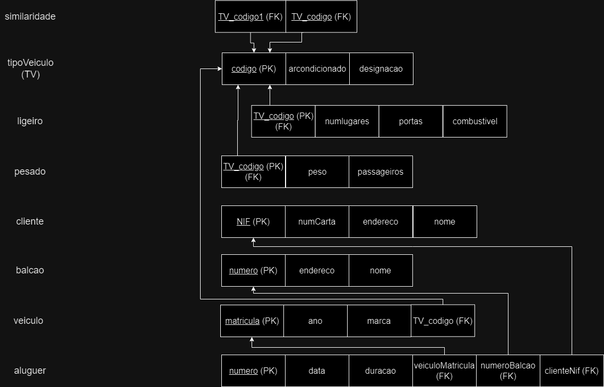
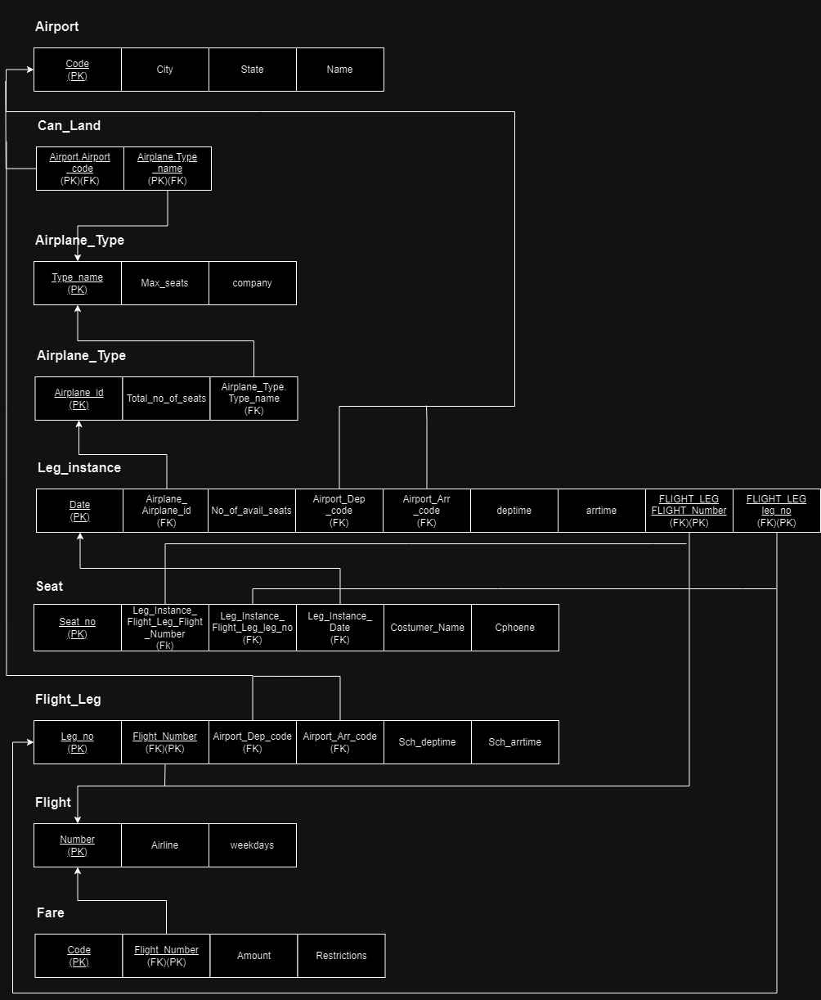
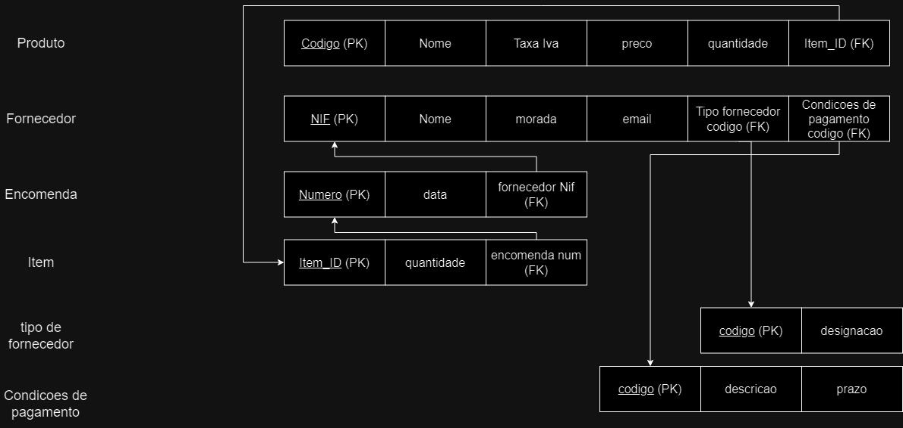
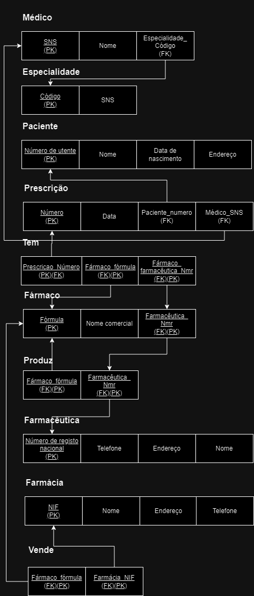
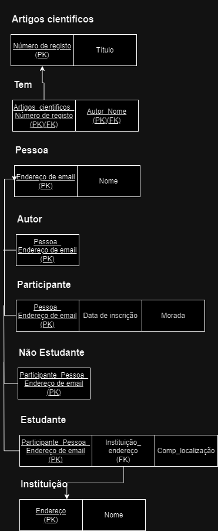
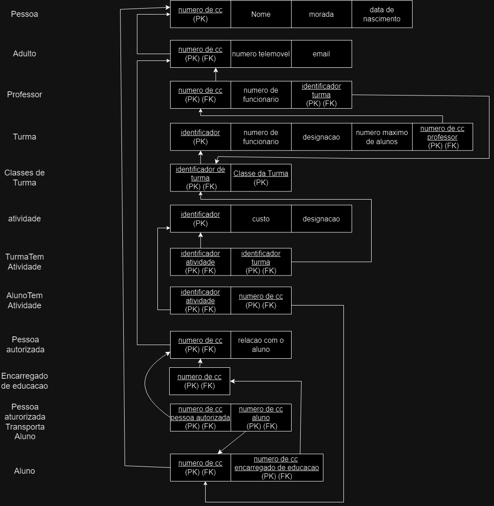

# BD: Guião 3


## ​Problema 3.1
 
### *a)*

```
Similaridade: TV_codigo1(FK) TV_codigo2(FK)
Tipo Veiculo: codigo, arcondicionado, designacao
Ligeiro: TV_codigo(FK), numLugares, portas, combustivel
Pesado: TV_codigo(FK), peso, passageiros
Cliente: NIF, num_carta, endereco, nome
Balcao: numero, endereco, nome
Veiculo: matricula, ano, marca
Aluguer: numero, data, duracao, cliente_nif(FK), veiculo_matricula(FK), balcao_numero(FK)

```


### *b)* 

```
Similaridade:	
Candidate Keys: None
	Primary Key: TV_codigo1 TV_codigo2
	Foreign Keys: TV_codigo1, TV_codigo2
Tipo Veiculo:
Candidate Keys: codigo
	Primary Key: codigo
	Foreign Keys: None
Ligeiro:
Candidate Keys:None
	Primary Key:TV_codigo
	Foreign Keys:TV_codigo
Pesado:
Candidate Keys:None
	Primary Key:TV_codigo
	Foreign Keys:TV_codigo
Cliente:
Candidate Keys: NIF, num_carta
	Primary Key: NIF
	Foreign Keys: None
Balcao:
Candidate Keys: Numero
	Primary Key: Numero
	Foreign Keys: None
Veiculo:
Candidate Keys: matricula
	Primary Key: matricula
	Foreign Keys: TV_codigo
Aluguer:
Candidate Keys: numero
	Primary Key: numero
	Foreign Keys: veiculoMatricula, numeroBalcao, clienteNif

```


### *c)* 




## ​Problema 3.2

### *a)*

```
AIRPORT: code , city , state , name
FLIGHT: number , airline , weekdays
FLIGHT_LEG:{flight_number(FK) ; leg_no}, AIRPORTdep-code(FK) , AIRPORTarr-code(FK) , sch_deptime , sch_arrtime
LEG_INSTANCE: {(FLIGHT_LEG_FLIGHT_Number(FK) ; FLIGHT_LEG_leg_no)(FK) , date}, AIRPLANE_Airplane_id(FK) , no_of_avail_seats , AIRPORT_Dep_code(FK) , AIRPORT_Arr_code(FK) , deptime , arrtime

SEAT:(LEG_INSTANCE_FLIGHT_LEG_flight_number,LEG_INSTANCE_FLIGHT_LEG_leg_no,LEG_INSTANCE_date)(FK), seat_no ,costumer_name,cphone

AIRPLANE: airplane_id, Total_no_of_seats , AIRPLANE_TYPE.Type_name(FK)
AIRPLANE_TYPE: Type_name , Max_seats , company
CAN_LAND: {AIRPORT_Airport_code ; AIRPLANE_TYPE_Type_Name}
FARE: {Flight_number(FK) ; Code} , Amount , Restrictions
```


### *b)* 

```
AIRPORT: 
Candidate keys: Airport_code
	Primary keys: Airport_code
	Foreign keys: None

AIRPLANE_TYPE: 
Candidate keys: Type_name
	Primary keys:Type_name
	Foreign keys: None

FLIGHT:
Candidate keys: Number
Primary keys: Number
Foreign keys: None

FLIGHT_LEG:
Candidate keys: leg_no
Primary keys: {FLIGHT_Number ;  leg_no}
Foreign keys: FLIGHT_Number, AIRPORTdep-code, AIRPORTarr-code

LEG_INSTANCE:
Candidate keys: date
Primary keys:  {FLIGHT_LEG_FLIGHT_Number ; FLIGHT_LEG_leg_no ; date}
Foreign keys: FLIGHT_LEG_FLIGHT_Number , FLIGHT_LEG_leg_no , AIRPLANE_Airplane_id , AIRPORT_Dep_code , AIRPORT_Arr_code

SEAT:
	Candidate keys: seat_no
	Primary keys: {Seat_no ; LEG_INSTANCE_FLIGHT_LEG_FLIGHT_Number ; LEG_INSTANCE_FLIGHT_LEG_leg_no}
	Foreign keys: LEG_INSTANCE_FLIGHT_LEG_FLIGHT_Number , LEG_INSTANCE_FLIGHT_LEG_leg_no , LEG_INSTANCE_date

AIRPLANE:
	Candidate keys: Airplane_id
	Primary keys: Airplane_id
	Foreign keys: Airplane_TYPE.Type_name

AIRPLANE_TYPE:
	Candidate keys: Type_name
	Primary keys: Type_name
	Foreign keys: None

CAN_LAND: 
	Candidate keys: AIRPORT.Airport_code, AIRPLANE.Type_name
	Primary keys: AIRPORT.Airport_code, AIRPLANE.Type_name
	Foreign keys: AIRPORT.Airport_code, AIRPLANE.Type_name

FARE:
	Candidate keys: Code
	Primary keys: {Code ; FLIGHT_Number}
	Foreign keys: FLIGHT_Number

```


### *c)* 




## ​Problema 3.3


### *a)* 2.1



### *b)* 2.2



### *c)* 2.3



### *d)* 2.4

